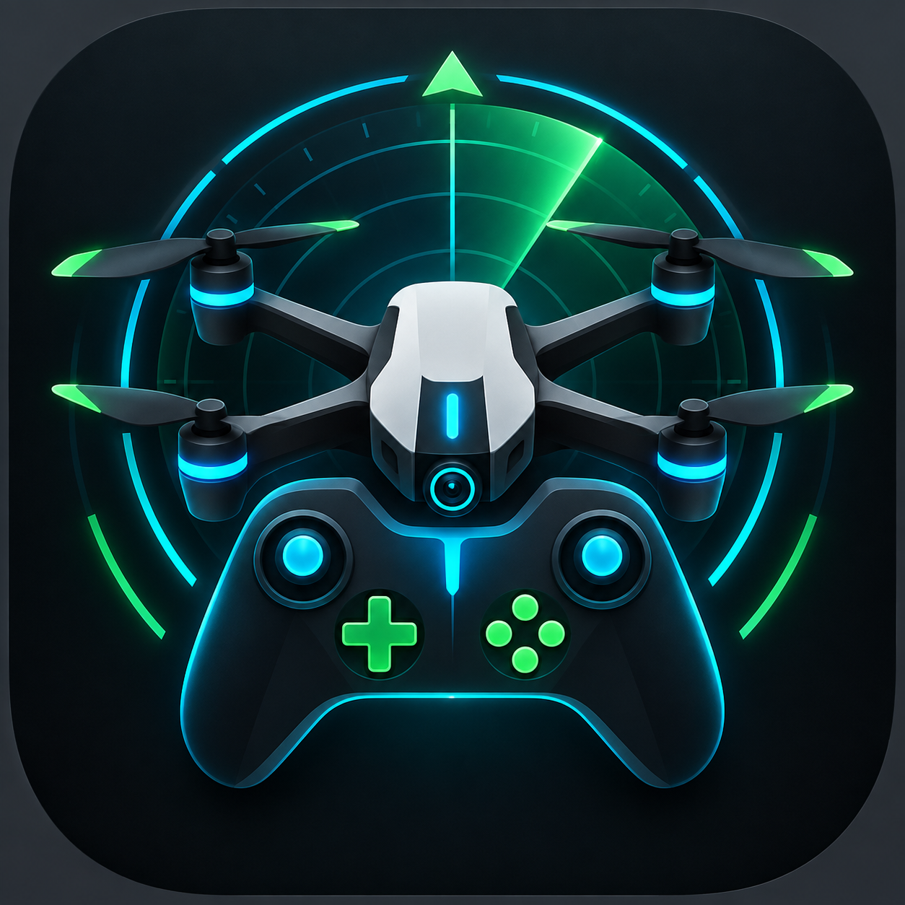

# Tello-Controler 🚁🎮

Native Android ground-control application for the **DJI/Ryze Tello EDU**, focused on low-latency manual flight, live video and Xbox controller support.

> Status: **M1 code complete / hardware validation required** (see [ROADMAP](ROADMAP.md)). Do not fly near people or obstacles until command mapping, failsafes and latency have been validated on the real aircraft.

## Product vision

Tello-Controler turns an Android phone into a lightweight FPV control station. The phone connects to the Tello over Wi-Fi and to an Xbox controller over Bluetooth. The project deliberately uses native Android/Kotlin so networking, gamepad input and hardware H.264 decoding can use Android APIs directly.

### M1 scope (first safe flight)
- Tello SDK mode over UDP
- Takeoff, land, emergency and RC control
- Continuous Xbox stick input with dead-zone
- Tello state/telemetry parsing
- Video transport receiver and native decoder integration point
- Landscape Compose flight HUD
- Connection/safety state
- Cloud APK build with GitHub Actions
- No backend, account or Play Store dependency

## Architecture

```text
Xbox controller ─Bluetooth─> Android input ─┐
                                           ├─> FlightViewModel ─> TelloClient ─UDP:8889─> Tello
Tello state ─────────────UDP:8890──────────>│
Tello H.264 ────────────UDP:11111──────────> TelloVideoReceiver ─> decoder ─> display
```

The Tello SDK endpoint is `192.168.10.1:8889`; state is received on UDP `8890` and video on UDP `11111`. SDK mode is entered with `command`, and video is enabled with `streamon`.

## Controls

| Xbox control | Default action |
|---|---|
| Left stick X | Yaw |
| Left stick Y | Throttle |
| Right stick X | Roll |
| Right stick Y | Pitch |
| A | Takeoff |
| B | Land (never blocked) |
| Y | Cycle rate: Slow / Normal / Sport |
| Menu (hold 1 s) | Emergency motor stop — release early to cancel |

RC values are normalized to the Tello `rc a b c d` range, with a configurable dead-zone (default 8 %) and rate profiles (Slow 35 %, Normal 65 %, Sport 100 %). Takeoff is refused without fresh telemetry or below the minimum battery (default 20 %). On-screen touch sticks appear automatically when no controller is connected (or always, via Settings); with a controller, the HUD shows the RC values actually sent. Axis directions are **not yet verified on hardware**.

## Build, release & update

Everything is automated by GitHub Actions — **Android Studio is not required**.

- **Every push / pull request** runs the unit tests and builds a signed APK (workflow artifact).
- **Every push to `main`** publishes a GitHub Release `v0.4.<build>` with the APK.
- **On the phone:** Settings → **UPDATE** downloads the latest release and installs it (phone on a Wi-Fi with Internet, not the Tello Wi-Fi). Android asks once to allow the app to install updates.

**First install:** open the [latest release](https://github.com/Miaouss90/Tello-Controler/releases/latest) on the phone, download the APK and open it. Builds up to v0.2.0 were signed with a throw-away debug key: uninstall that version once before installing v0.3 or later.

## Documentation

- [Requirements & product decisions](docs/REQUIREMENTS.md)
- [Architecture](docs/ARCHITECTURE.md)
- [Safety](docs/SAFETY.md)
- [Roadmap](ROADMAP.md)
- [Contributing](CONTRIBUTING.md)
- [AI agent guide](AGENTS.md)

## Development principles

1. **Safety before features** — stale controller input must never remain an active command.
2. **Native where latency matters** — UDP, gamepad and video stay close to Android APIs.
3. **Hardware-testable increments** — networking, control, telemetry and video are independently diagnosable.
4. **No unnecessary cloud dependency** — the phone talks directly to the aircraft.
5. **Document decisions** — product requirements from the design discussion are maintained in `docs/`.

## References

The protocol implementation follows the official RoboMaster TT / Tello SDK 3.0 documentation. See `docs/PROTOCOL.md`.

## License

No license has been selected yet. All rights reserved until a license is explicitly added.
